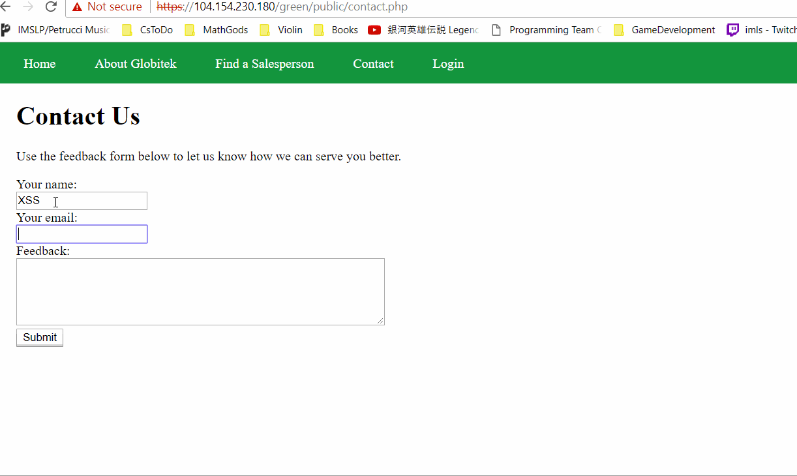

# Cybersecurity_Week8_Assignment

# Project 8 - Pentesting Live Targets

Time spent: 2 hours spent in total

> Objective: The challenge is to attempt to find and exploit the vulnerabilities. The goal is to identify which two vulnerabilities 
of each site: red, green, and blue.

The following **required** functionality is completed:

1. [X]  Required: Challenge 0 - Username Enumeration
1. [X]  Required: Challenge 1 - Insecure Direct Object Reference (IDOR)
1. [X]  Required: Challenge 2 - SQL Injection (SQLi)
1. [X]  Required: Challenge 3 - Cross-Site Scripting (XSS)
1. [X]  Required: Challenge 4 - Cross-Site Request Forgery (CSRF)
1. [X]  Required: Challenge 5 - Session Hijacking/Fixation

## Challenge 0: Username Enumeration
- Vulnerability Site: Green
- Vulberability: When you try to log onto an unexistent account you get plaintext but if the account you choose is known the text is bold. This can be exploit more by brute force.

Here's a walkthrough of implemented vulnerability:

GIF created with [LiceCap](http://www.cockos.com/licecap/).

## Challenge 1: Insecure Direct Object Reference (IDOR)
- Vulnerability Site: Red
- Vulberability: You have a screen of salepeorsons and their territories on each site. This great but they store params in the url for the red site this can be exploited. By picking ID 10, 11 which arent protected.
You are able to see Testy McTesterson and Lazy Lazyman who are not visible on the Green and Blue sites.  The programmer did not disable those users on the red site leaving the IDOR vulnerability.

Here's a walkthrough of implemented vulnerability:

GIF created with [LiceCap](http://www.cockos.com/licecap/).

## Challenge 2: SQL Injection (SQLi)
- Vulnerability Site: Blue
- Vulberability: The programmer of the blue site fails to santize his data properly letting you do an sql injection into the url of the site. Try something like a sleep request and you have verifcation.

Here's a walkthrough of implemented vulnerability:

GIF created with [LiceCap](http://www.cockos.com/licecap/).

## Challenge 3: Cross-Site Scripting (XSS)
- Vulnerability Site: Green
- Vulberability: Script tages are not changed on green comments so a simple message like this is a major exploit The alert message: 

Here's a walkthrough of implemented vulnerability:

GIF created with [LiceCap](http://www.cockos.com/licecap/).

## Challenge 4: Cross-Site Request Forgery (CSRF)
- Vulnerability Site: Red
- Vulberability: If you create a malicious page that uses a user's session to
 forge a post request to the database. It will carry through a edit command. This is bad with the super long session ids.

Here's a walkthrough of implemented vulnerability:

GIF created with [LiceCap](http://www.cockos.com/licecap/).

## Challenge 5: Session Hijacking/Fixation
- Vulnerability Site: Red
- Vulberability: The SessionID is shared between sites ie not very secure logging into blue logs you into red which is very bad

GIF created with [LiceCap](http://www.cockos.com/licecap/).

## Notes
Interesting labe 
